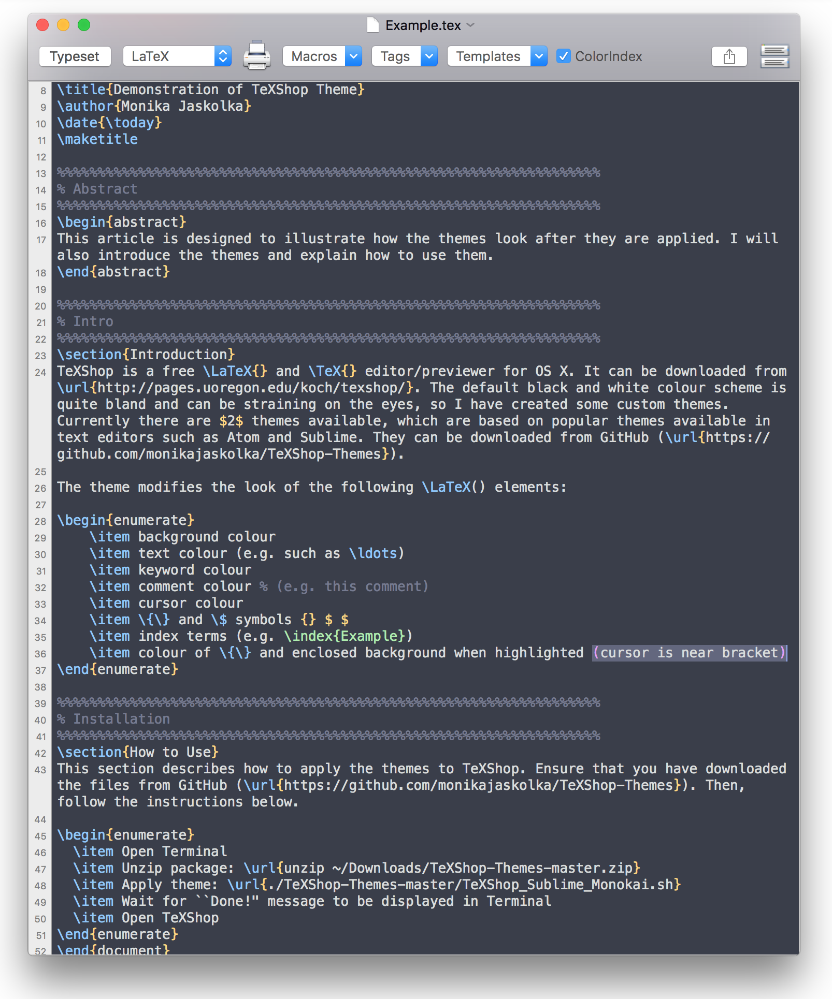
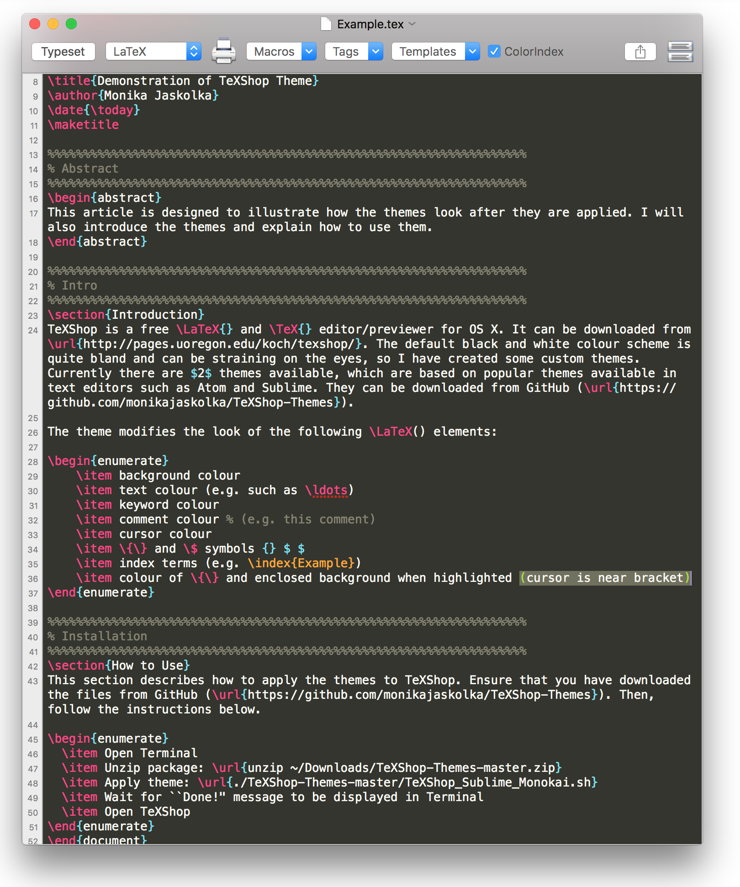

# TeXShop-Themes
Some themes for TeXShop. 

### Atom One Dark Vivid
Inspired by [Atom One Dark Vivid](https://atom.io/themes/one-dark-vivid-syntax) theme for [Atom](https://atom.io/).

### Sublime Monokai
Inspired by Monokai (default) theme for [Sublime Text](https://www.sublimetext.com/).

## TeXShop 4.08 and later:
1. Download
2. Unzip: `unzip ~/Downloads/TeXShop-Themes-master.zip`
3. Copy the .plist files into `~/Library/TeXShop/Themes`: `cp TeXShop-Themes-master/*.plist ~/Library/TeXShop/Themes`
4. Open TeXShop and go to `Preferences > Themes`
5. Select the theme from the Themes drop down menus and press OK

## TeXShop 4.07 and earlier:
1. Download
2. Open Terminal
2. Unzip: `unzip ~/Downloads/TeXShop-Themes-master.zip`
3. Run the script: e.g. `~/TeXShop-Themes-master/TeXShop_Sublime_Monokai.sh`
4. Close and re-open any TeXShop windows you may have open

Tested on OS X 10.14.6.
